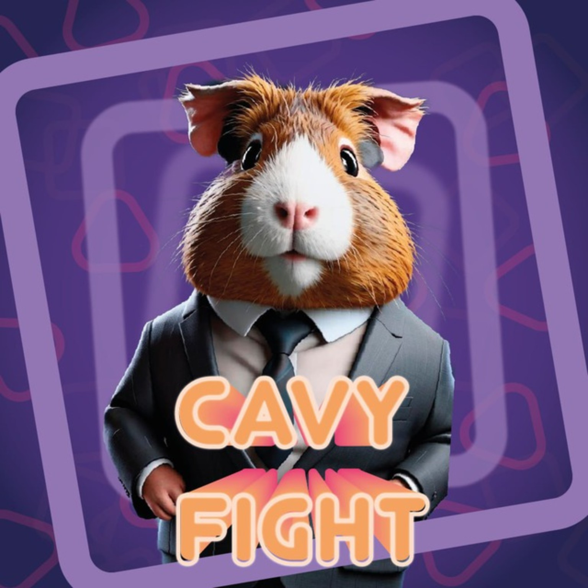

<div align="center">



# 🐹 Cavy Fight

**Telegram Mini App clicker game inspired by Hamster Kombat**

Незавершённая развлекательная игра, созданная для моей группы в колледже.


</div>

## О проекте

**Cavy Fight** — небольшой multiplayer-oriented clicker / idle game, появившийся во время пика популярности Hamster Kombat.

Изначально проект создавался в первую очередь как локальная развлекательная игра для студентов моей группы в колледже: свой Telegram-бот, внутриигровые аккаунты, монеты, прогресс, задания, рейтинг и другие механики.

Игрок запускал игру непосредственно из Telegram Mini App, после чего мог развивать свой аккаунт и накапливать внутриигровые баллы.

При этом Cavy Fight задумывался не только как отдельный кликер.

## 🌐 Изначальная идея

В перспективе вокруг Cavy Fight должна была появиться небольшая **экосистема проектов**, объединённых одной системой аккаунтов и баллов.

Баллы, заработанные в игре, планировалось использовать и за её пределами — в других развлекательных сервисах, мини-играх и внутренних проектах.

Идея примерно выглядела так:

```text
                    ┌──────────────┐
                    │  Cavy Fight  │
                    │   clicker    │
                    └──────┬───────┘
                           │
                      Cavy Points
                           │
              ┌────────────┼────────────┐
              │            │            │
              ▼            ▼            ▼
         Mini Game A   Mini Game B   Other services
```

Таким образом, Cavy Fight должен был стать одной из точек входа в общую систему, а накопленный игровой прогресс — иметь применение в нескольких проектах.

Эта часть концепции осталась на стадии идеи.

## 🎮 Что было реализовано

В репозитории успели появиться основы полноценного Telegram-приложения:

* Telegram-бот для запуска игры;
* Telegram Mini App;
* авторизация пользователя через Telegram;
* JWT access/refresh tokens;
* аккаунты игроков;
* MongoDB для хранения данных;
* монеты;
* уровни и XP;
* профиль;
* задания;
* рейтинг;
* экран майнинга / получения ресурсов;
* базовая архитектура игрового сервера;
* WebSocket-соединение с игровым сервером;
* отдельный HTTP API;
* задел под дальнейшее расширение игровых механик.

Проект остановился до завершения всех задуманных систем, поэтому часть интерфейсов и серверной логики может быть незаконченной.

## 🏗️ Архитектура

Проект состоит из нескольких частей:

```text
cavy-fight/
├── game/                   # Игровой сервер и сущности игроков
│   ├── packets/            # Пакеты игрового протокола
│   ├── CavyFightServer.js
│   └── Player.js
│
├── routers/                # HTTP API и авторизация
│
├── vue/                    # Telegram Mini App frontend
│   └── src/
│       ├── components/
│       ├── assets/
│       └── App.vue
│
├── CavyBackDatabase.js     # Работа с MongoDB
├── cavyBackUtils.js
├── webserver.js            # Express HTTPS server
└── main.js                 # Entry point / Telegram Bot
```

### Backend

Backend написан на **Node.js** и использует:

* Express;
* Telegraf;
* MongoDB;
* JSON Web Tokens;
* WebSocket;
* Telegram Mini Apps Init Data validation.

HTTP API работает отдельно от игрового WebSocket-сервера.

### Frontend

Клиентская часть находится в директории `vue/`.

Основной стек:

* Vue 3;
* Vite;
* Telegram Mini Apps SDK;
* JavaScript / TypeScript.

Интерфейс был разбит на отдельные игровые экраны, включая:

```text
Game
Mining
Profile
Quests
Rank
Activities
```

## 🔐 Авторизация

Для идентификации игроков использовались данные Telegram Mini App.

Схема предполагала примерно следующий поток:

```text
Telegram
   │
   ▼
Telegram Mini App
   │
   │ initData
   ▼
Cavy Fight API
   │
   ├── Telegram validation
   │
   └── JWT
       ├── Access Token
       └── Refresh Token
```

После авторизации игровой аккаунт связывался с Telegram ID пользователя.

## 🗄️ Данные игрока

В MongoDB предполагалось хранить состояние аккаунта, например:

```js
{
  _id: telegramUserId,
  account_created_at: Date.now(),
  level: 0,
  xp_points: 0,
  coins: 0
}
```

По мере разработки модель должна была расширяться новыми игровыми механиками.

## 🚀 Локальный запуск

> ⚠️ Проект давно не поддерживается и не является готовым production-приложением. Инструкция ниже описывает структуру разработки, но некоторые части могут потребовать доработки.

### Backend

Установите зависимости:

```bash
npm install
```

Для работы backend необходим файл `secret.js`, который намеренно не хранится в Git.

Пример структуры:

```js
export const bot_token = "YOUR_TELEGRAM_BOT_TOKEN";
export const dbUrl = "mongodb://localhost:27017";

export const jwtSecret = "YOUR_JWT_SECRET";
export const apiSecret = "YOUR_API_SECRET";

export const ngrok_token = "YOUR_NGROK_TOKEN";
```

Также HTTPS-сервер ожидает сертификаты:

```text
certs/
├── cert.pem
└── privkey.pem
```

После настройки:

```bash
npm start
```

В текущей архитектуре используются:

```text
HTTPS API       :3000
WebSocket Game  :8080
```

### Frontend

```bash
cd vue
npm install
npm run dev
```

Для production-сборки:

```bash
npm run build
```

## ⚠️ Состояние проекта

**Разработка прекращена.**

Cavy Fight создавался в период массовой популярности Telegram-кликеров и Hamster Kombat. К моменту дальнейшего развития проекта интерес к оригинальной игре и всему жанру начал быстро снижаться.

Продолжать строить большую экосистему вокруг механики, популярность которой уже уходила, перестало иметь смысл, поэтому проект остался незавершённым.

Репозиторий сохранён как:

* часть истории моих проектов;
* пример ранней разработки Telegram Mini Apps;
* эксперимент с игровым backend;
* эксперимент с Telegram-аутентификацией;
* прототип системы общей игровой экономики между несколькими проектами.

## 📌 Historical notes

В исходниках остались некоторые исторические URL, названия и элементы первоначальной концепции проекта.

Они могут больше не существовать или не соответствовать текущим сервисам.

Проект не связан с разработчиками Hamster Kombat и не является официальным клиентом, форком или продолжением оригинальной игры.

## 📜 License

См. условия лицензирования репозитория.

---

**Cavy Fight 🐹**
*A small college project from the Telegram clicker era.*
